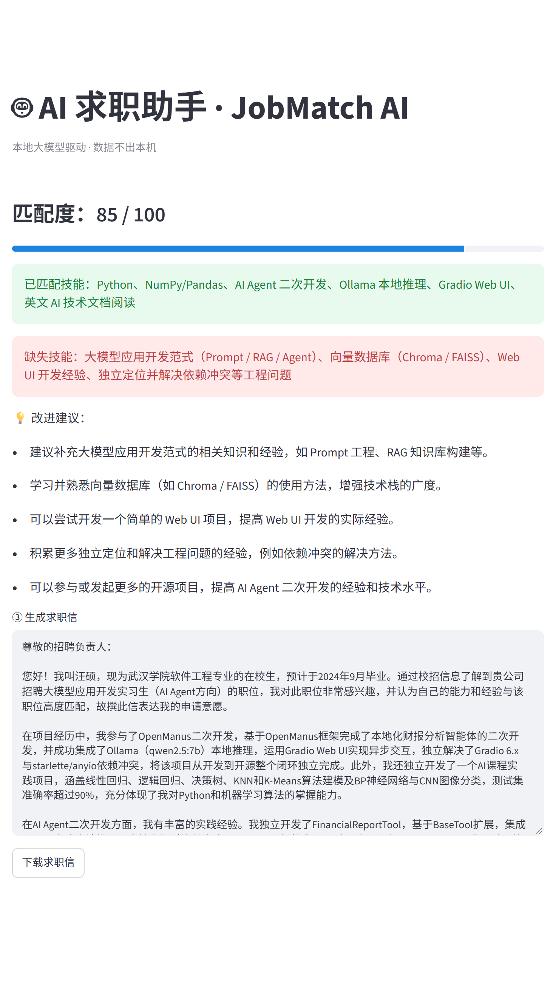

# AI 求职助手 · JobMatch AI

本地运行的大模型求职助手：输入 JD + 你的简历，自动输出匹配度评分、缺失技能、改进建议，并可一键生成求职信。
全程基于本地大模型（Ollama + qwen2.5:7b）推理，**简历数据不出本机**。

## ✨ 功能
- 匹配度评分（0-100）+ 进度条可视化
- 已匹配 / 缺失技能清单
- 针对该岗位的简历改进建议
- 一键生成并下载个性化求职信

## 🧱 技术栈
- Python 3
- Streamlit（Web 界面）
- Ollama + qwen2.5:7b（本地推理）
- JSON Schema 结构化输出

## 🚀 快速开始
### 1. 准备本地模型
```bash
ollama pull qwen2.5:7b
```
### 2. 安装依赖
```bash
git clone https://github.com/97-sc/jobmatch-ai.git
cd jobmatch-ai
python -m venv venv
source venv/Scripts/activate     # Windows Git Bash
pip install -r requirements.txt
```
### 3. 启动
```bash
streamlit run app.py
```
浏览器打开 http://localhost:8501 ，填入 JD 与简历即可。

## 📷 效果截图

输入 JD 与简历后，自动输出**匹配度评分、已匹配 / 缺失技能、改进建议**，并一键生成求职信：

<p align="center">
  
</p>

## 📁 项目结构
```
jobmatch-ai/
├── app.py                  # Streamlit 界面
├── core/
│   ├── __init__.py         # 使 core 成为 Python 包
│   ├── ollama_client.py    # 调用本地 Ollama
│   ├── prompts.py          # 提示词模板
│   ├── matcher.py          # 匹配度分析
│   └── cover_letter.py     # 求职信生成
└── requirements.txt
```

## 📄 License
MIT
